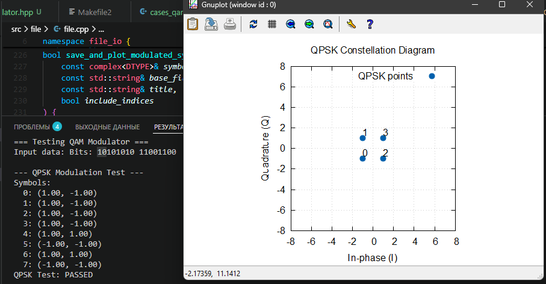
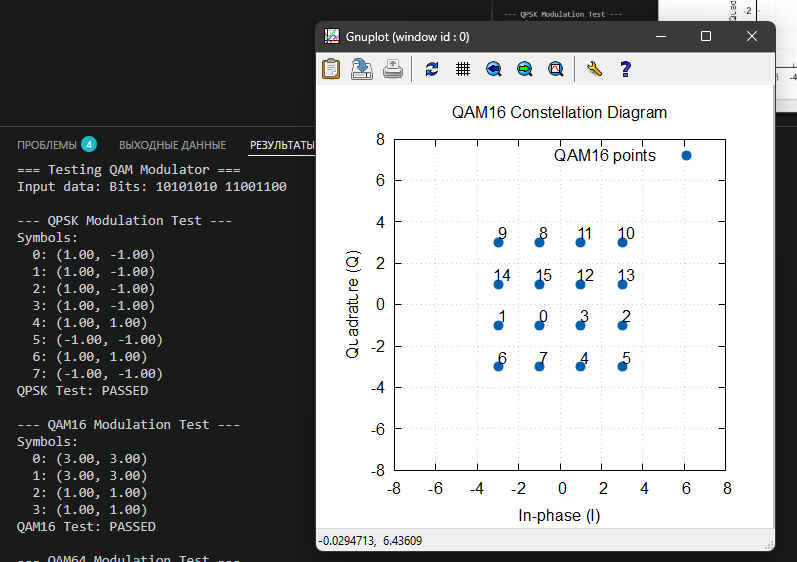
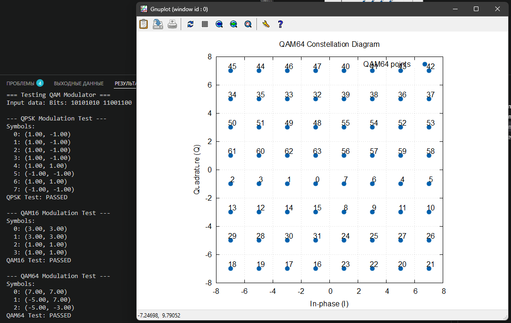

# Test yadro task

[!NOTE] PS я старался

### Description 

This repository contains the solution to the task from YaDro 2025.

### Task

Вариант 1
1. Написать на языке С++ класс, выполняющий функциональность модулятора QAM (QPSK, QAM16, QAM64)
2. Написать на языке С++ класс, выполняющий функциональность добавления гауссовского шума к созвездию QAM
З. Написать на языке С++ класс, выполняющий функциональность демодулятора QAM (QPSK, QAM16, QAM64)
4. Написать последовательный вызов 1-3 для случайной последовательности бит для разных значений дисперсия шума
5. Построить график зависимости вероятности ошибки на бит от дисперсии шуме

### Output
./build/ber_sigma_qpsk.csv
файл с данными ber vs sigma для QPSK модуляции
формат данных: {sigma,ber}

./build/ber_sigma_qam16.csv
файл с данными ber vs sigma для QAM16 модуляции
формат данных: {sigma,ber}

./build/ber_sigma_qam64.csv
файл с данными ber vs sigma для QAM64 модуляции
формат данных: {sigma,ber}

### Modulation verification

*Тест кейс для QPSK*

*Тест кейс для QAM16*

*Тест кейс для QAM64*

### BER vs Sigma

*Тест кейс для QAM64*
